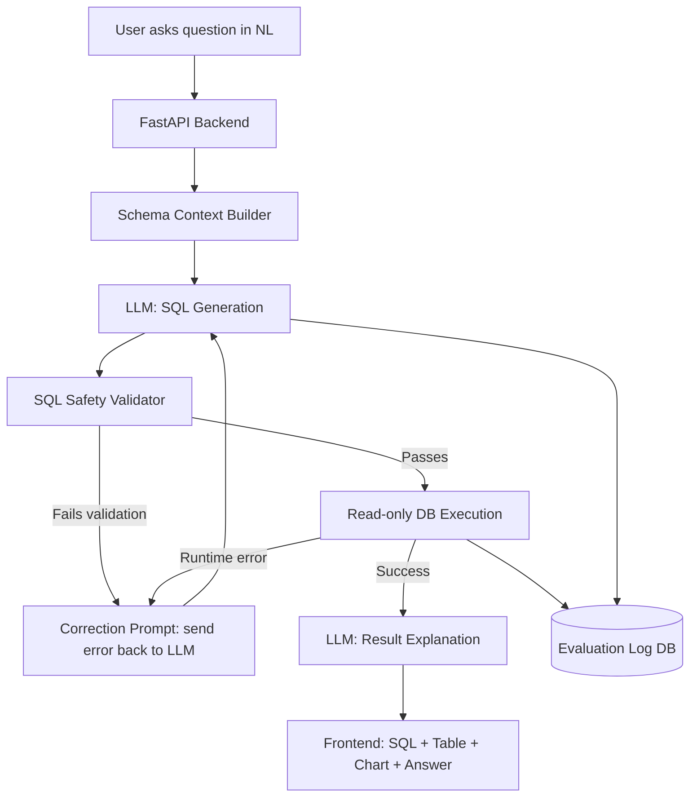

# Architecture — NL-to-SQL Analytics Copilot

## 1. Problem Statement
Business users and analysts need answers from data ("which region had the biggest drop in repeat customers last quarter?") but most can't write SQL, and analysts spend a large share of their time on repetitive ad-hoc query requests. This project builds a copilot that converts a plain-English question into a **validated, safe, executed SQL query** against a real database, then explains the result in plain English — with a self-correction loop so it recovers from its own mistakes instead of just failing.

## 2. System Overview

## 3. Components

### 3.1 Frontend — Next.js + TypeScript
- Chat-style interface: question box, conversation history
- Collapsible "Generated SQL" panel (editable — user can tweak and re-run)
- Results table + auto-selected chart (bar/line via Recharts, based on result shape)
- Plain-English answer panel
- Schema browser sidebar (tables/columns available, so users know what they can ask)

### 3.2 Backend — FastAPI (Python)
- `/ask` endpoint: orchestrates the full pipeline (steps 3.3–3.6 below)
- `/schema` endpoint: returns live DB schema for the frontend sidebar
- `/history` endpoint: returns past queries from the evaluation log

### 3.3 Schema Context Builder
- Pulls table names, column names, types, and 2–3 sample rows per table
- Injects this into the LLM system prompt so it never has to guess column names
- This is the single biggest lever against hallucinated SQL — most NL-to-SQL failures come from the model inventing a column that doesn't exist

### 3.4 LLM Layer (Claude API)
- System prompt: schema context + strict rules (SELECT-only, must use exact column names, must include a LIMIT, no destructive statements)
- Few-shot examples: 3–5 hand-written question→SQL pairs specific to this schema
- Output: SQL query + one-line rationale (structured JSON output, not free text)

### 3.5 Safety Validator (sqlglot-based)
Non-negotiable gate before any query touches the database:
- Parse SQL into an AST — reject anything that isn't a single `SELECT` statement
- Reject `INSERT`/`UPDATE`/`DELETE`/`DROP`/`ALTER`/multiple statements/comments used to hide a second statement
- Cross-check every referenced table/column against the real schema (catches hallucinations before execution)
- Auto-inject a `LIMIT` cap if missing (prevents runaway full-table scans)
- Enforce a query execution timeout (e.g. 5s) at the DB driver level

### 3.6 Self-Correction Loop
- If validation fails (bad syntax, hallucinated column, disallowed statement) → the exact error message is sent back to the LLM as a correction prompt: "Your query failed because X. Here is the schema again. Fix it."
- If the query is valid SQL but the database throws a runtime error → same loop
- Capped at 3 attempts; if still failing, return a clear "couldn't answer confidently" message instead of guessing

### 3.7 Explanation Layer
- Takes the raw result set (JSON rows) and re-prompts the LLM to produce a 1–2 sentence plain-English answer, plus a suggested chart type
- Kept as a separate LLM call from SQL generation, so this step has zero ability to alter data — it's read-only, purely descriptive

### 3.8 Evaluation Log (this is your resume metric)
Every question, generated SQL, validation result, number of correction attempts, and final outcome is logged to a small `query_log` table. This is what lets you later say something like *"87% first-try valid SQL rate, 96% after self-correction, across a 30-question benchmark"* — a real, measured number instead of a vague claim.

## 4. Tech Stack

| Layer | Choice | Why |
|---|---|---|
| Frontend | Next.js, TypeScript, Recharts | Matches your Causal Impact project — consistent stack story |
| Backend | FastAPI (Python) | Already in your skill set; async-friendly for LLM calls |
| LLM | Claude API (Sonnet) | Strong structured-output and SQL reasoning |
| SQL parsing/validation | sqlglot | AST-level parsing, not regex — genuinely safe |
| Database | PostgreSQL (or SQLite for local dev) | Realistic business schema (e.g. orders/customers/products) |
| Deployment | Render/Vercel | Free tier, matches your existing deployment pattern |

## 5. Security Notes (mention this explicitly in your resume/interview — it's a differentiator)
- Backend connects to the DB using a **read-only role**, not the app's admin credentials — defense in depth even if the validator is somehow bypassed
- All queries run with a row-limit cap and execution timeout regardless of what the LLM generates
- No user-supplied text ever gets string-concatenated directly into SQL — the LLM only ever produces a full query string that is then parsed and validated, never executed via raw string interpolation with user input
